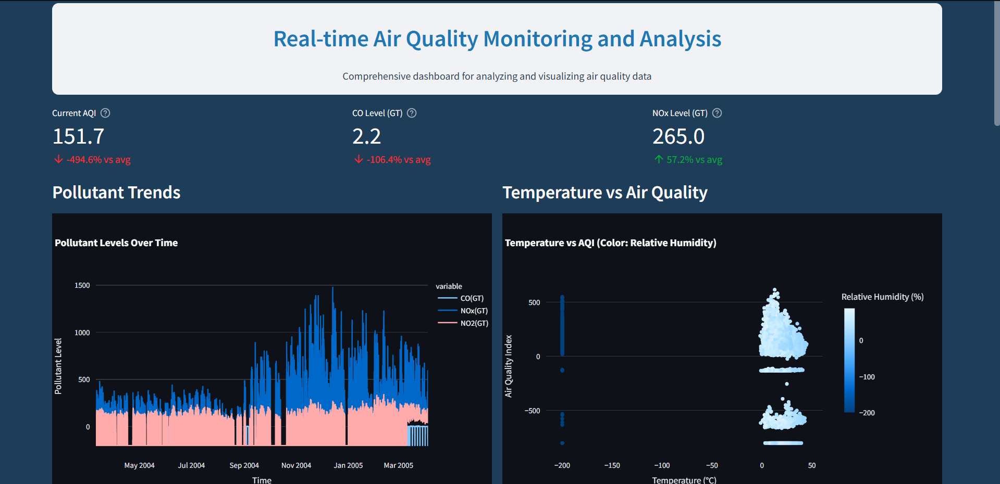
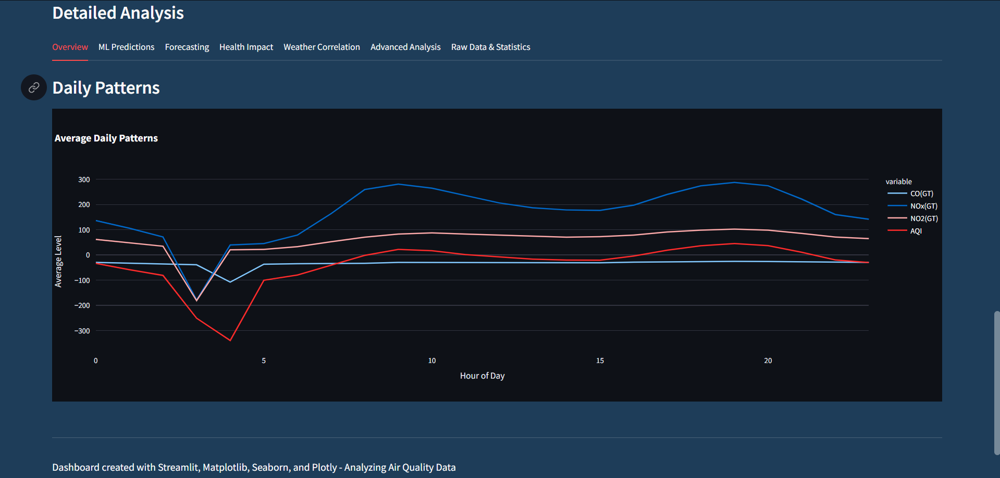
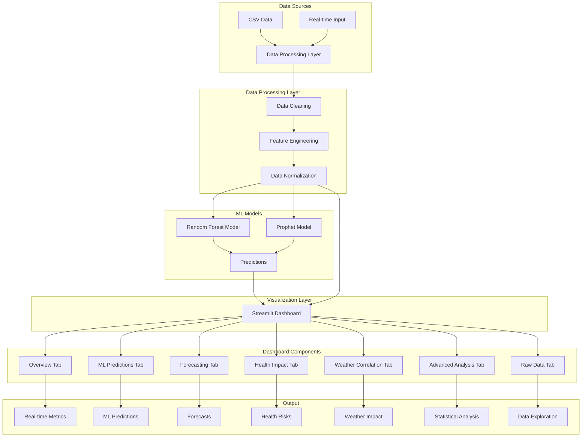

# 🌍 Air Quality Analysis Dashboard

<div align="center">
  <!--  -->
  
  [](https://www.python.org/downloads/)
  [](https://streamlit.io/)
  [](https://scikit-learn.org/)
  [](LICENSE)
  [](https://github.com/Suhani2305/AirIndexAnalysis)
</div>

## 📋 Overview

A comprehensive air quality analysis dashboard leveraging machine learning and advanced statistical analysis to monitor, predict, and analyze air quality patterns. This system helps authorities and researchers make data-driven decisions to improve air quality and public health.

<div align="center">
  
  
</div>

## 🎯 Project Objectives

1. **Real-time Air Quality Monitoring**
   - Track current AQI levels and pollutant concentrations
   - Monitor temperature and humidity correlations
   - Provide instant alerts for hazardous conditions
   - Display historical trends and patterns

2. **Predictive Analysis & Forecasting**
   - Develop ML models to predict future AQI values
   - Generate 24-hour air quality forecasts
   - Identify potential pollution hotspots
   - Enable proactive decision-making

3. **Health Impact Assessment**
   - Evaluate health risks based on AQI levels
   - Provide safety guidelines and recommendations
   - Track health impact distribution
   - Generate health advisories for different groups

4. **Environmental Pattern Analysis**
   - Analyze weather-pollutant relationships
   - Identify seasonal patterns and trends
   - Study correlation between different pollutants
   - Detect anomalies and unusual patterns

5. **Data-Driven Decision Support**
   - Provide comprehensive statistical analysis
   - Enable data exploration and visualization
   - Support policy-making with evidence
   - Facilitate research and studies

## 🌟 Key Features

<table>
  <tr>
    <td width="25%">
      <div align="center">
        <h3>📊 Real-time Monitoring</h3>
        <ul align="left">
          <li>Current AQI levels</li>
          <li>Pollutant tracking</li>
          <li>Weather correlations</li>
          <li>Historical trends</li>
        </ul>
      </div>
    </td>
    <td width="25%">
      <div align="center">
        <h3>🤖 ML Predictions</h3>
        <ul align="left">
          <li>AQI forecasting</li>
          <li>Pattern analysis</li>
          <li>Anomaly detection</li>
          <li>Feature importance</li>
        </ul>
      </div>
    </td>
    <td width="25%">
      <div align="center">
        <h3>🏥 Health Impact</h3>
        <ul align="left">
          <li>Risk assessment</li>
          <li>Safety guidelines</li>
          <li>Impact analysis</li>
          <li>Health advisories</li>
        </ul>
      </div>
    </td>
    <td width="25%">
      <div align="center">
        <h3>📈 Advanced Analysis</h3>
        <ul align="left">
          <li>Statistical tests</li>
          <li>Seasonal patterns</li>
          <li>Correlation analysis</li>
          <li>Outlier detection</li>
        </ul>
      </div>
    </td>
  </tr>
</table>

## 🛠️ Technical Stack

<div align="center">
  
  
  
  
  
  
  
</div>

## 📊 System Architecture



## 🚀 Getting Started

### Prerequisites
- Python 3.12 or higher
- Git

### Installation

1. Clone the repository
```bash
git clone https://github.com/Vikas3108/Air_Quality_Index-with-Machine_Learning
cd AirIndexAnalysis
```

2. Install dependencies
```bash
pip install -r requirements.txt
```

3. Start the dashboard
```bash
streamlit run app.py
```

4. Access the dashboard at `http://localhost:8501`

## 📁 Project Structure

```
AirIndexAnalysis/
├── app.py                  # Main dashboard application
├── ml_models.py           # Machine learning models
├── requirements.txt       # Project dependencies
├── airquality.csv        # Air quality dataset
└── README.md             # Project documentation
```

## 🔍 Data Sources

### Input Data
- Carbon Monoxide (CO)
- Nitrogen Oxides (NOx)
- Nitrogen Dioxide (NO2)
- Temperature
- Relative Humidity
- Time-based features

### Data Format
```python
{
    'DateTime': datetime,
    'CO(GT)': float,
    'NOx(GT)': float,
    'NO2(GT)': float,
    'T': float,
    'RH': float,
    'AQI': float
}
```

## 🔧 Technical Details

### Data Processing
- DateTime conversion
- AQI calculation
- Feature engineering
- Data normalization

### Machine Learning Models
1. **Random Forest Regressor**
   - Features: CO, NOx, NO2, T, RH, Hour, Month, DayOfWeek
   - Target: AQI
   - Performance metrics: R², MSE, Anomaly Ratio

2. **Prophet Model**
   - Time series forecasting
   - Seasonal decomposition
   - Trend analysis

### Statistical Analysis
- Normality tests
- Correlation analysis
- Seasonal decomposition
- Granger causality
- Outlier detection

## 📈 Performance Metrics

### Model Performance
- R² Score: Model fit quality
- MSE: Prediction accuracy
- Anomaly Ratio: Unusual patterns

### Data Quality Metrics
- Missing values
- Duplicate entries
- Data completeness
- Memory usage

## 🔐 Security Features

- Data validation
- Input sanitization
- Error handling
- Resource management

## 🌐 Performance Optimization

- Data caching
- Lazy loading
- Memory management
- Query optimization

### 📊 Available Reports 

1. **CSV Export**
   - Raw data with all measurements
   - Filtered data based on selection

2. **PDF Reports**
   - Overview Statistics
   - Pollutant Trends
   - Temperature Impact Analysis
   - Statistical Analysis
   - Correlation Analysis
   - Daily Patterns
   - ML Model Performance (if available)
